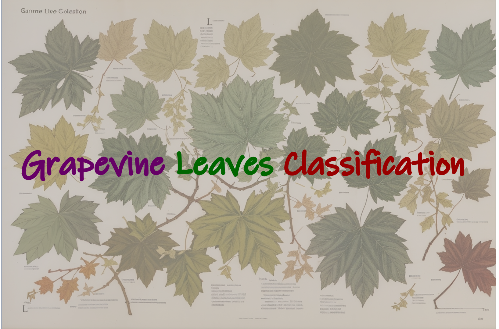
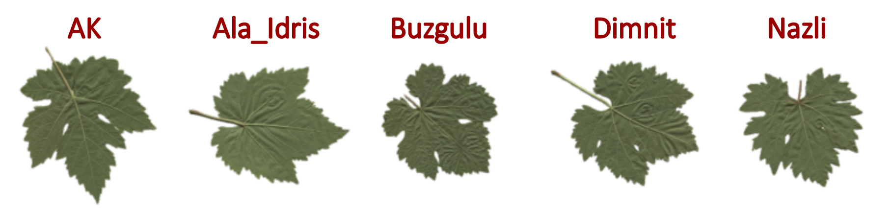
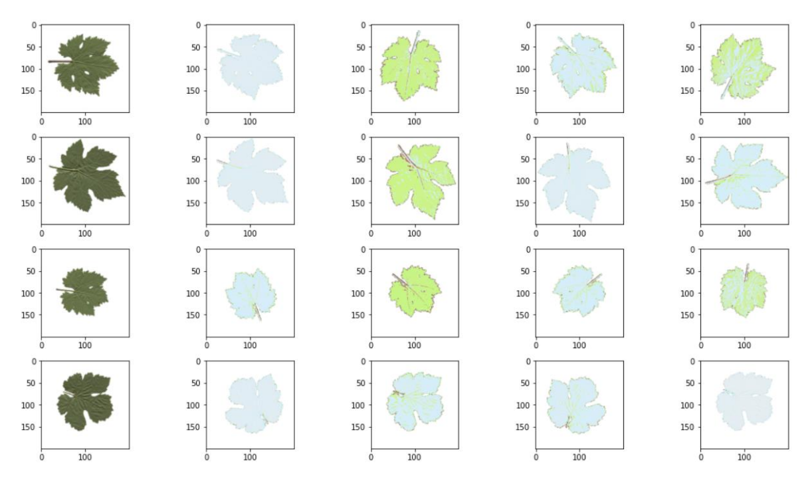

# Grapevine-Leaves-Classification
This project focuses on classifying grapevine leaves into different categories using data mining techniques. It involves data preprocessing, model training, and evaluation.

## Table of Contents
1. [Introduction](#introduction)
2. [Data Preparation](#data-preparation)
3. [Model Training](#model-training)
4. [Model Evaluation](#model-evaluation)
5. [Results](#results)
---

## Introduction 

The objective of this project is to classify grapevine leaves into different categories. This classification task is essential for various applications in agriculture, such as disease detection and yield prediction. The project utilizes machine learning and deep learning techniques to achieve accurate classification results.

## Data Preparation 

### Data Collection

The dataset used in this project contains images of grapevine leaves from different varieties. The images are organized into categories based on the type of leaves.

### Data Preprocessing

- The images are resized to a consistent size (e.g., 227x227 pixels) to ensure uniformity.
- Data augmentation techniques such as rotation, brightness adjustment, and horizontal flipping are applied to increase the dataset's diversity.
   
- The dataset is split into training, validation, and test sets.

## Model Training 

Several deep learning models are employed for the classification task. Notable models include:

- **EfficientNetB3**
- **ResNet50**
- **VGG19**
- **Xception**

Each model is trained on the training dataset, and its performance is evaluated on the validation set. The best-performing model is selected for further evaluation.

## Model Evaluation 

The selected model's performance is assessed on the test dataset. Evaluation metrics include accuracy, precision, recall, and F1-score. A confusion matrix is also generated to visualize the classification results.

